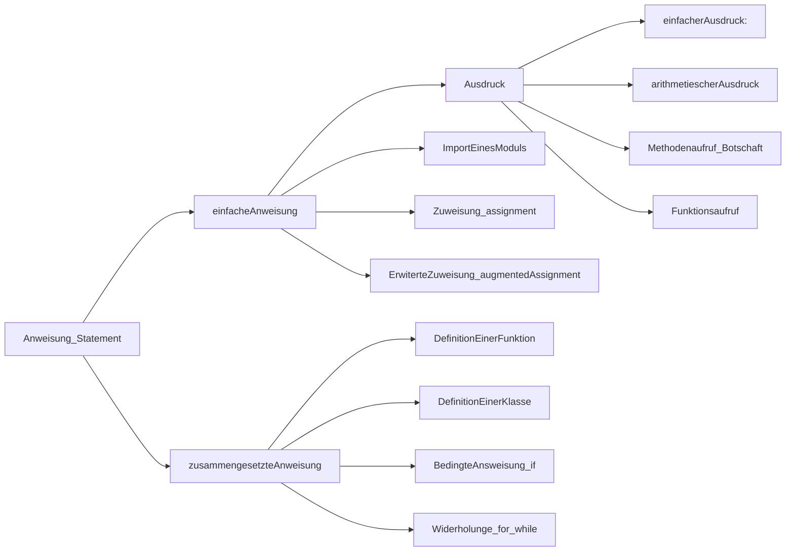
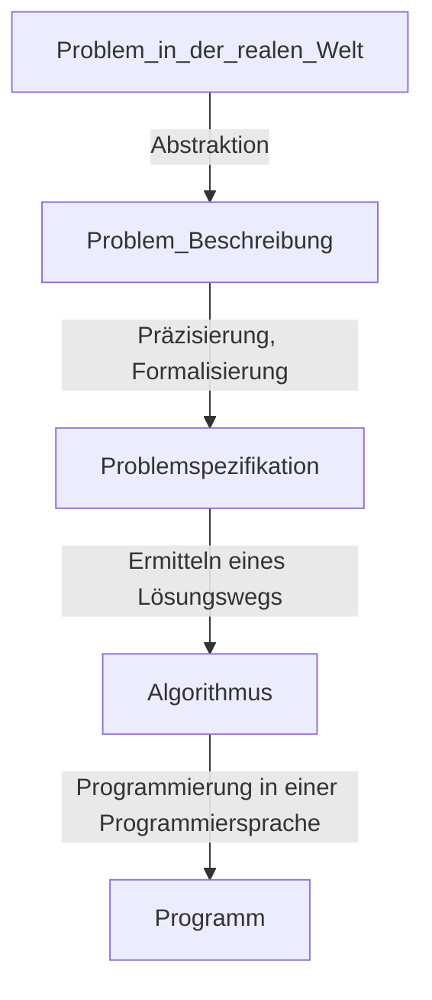

# Grafiken/ Konzepte

## Anweisungen

```mermaid
graph LR;
    Anweisung_Statement --> einfacheAnweisung;
    Anweisung_Statement --> zusammengesetzteAnweisung;
    
    einfacheAnweisung --> Ausdruck;
    einfacheAnweisung --> ImportEinesModuls;
    einfacheAnweisung --> Zuweisung_assignment;
    einfacheAnweisung --> ErwiterteZuweisung_augmentedAssignment;

    Ausdruck --> einfacherAusdruck:
    Ausdruck --> arithmetiescherAusdruck;
    Ausdruck --> Methodenaufruf_Botschaft;
    Ausdruck --> Funktionsaufruf;

    zusammengesetzteAnweisung --> DefinitionEinerFunktion;
    zusammengesetzteAnweisung --> DefinitionEinerKlasse;
    zusammengesetzteAnweisung --> BedingteAnsweisung_if;
    zusammengesetzteAnweisung --> Widerholunge_for_while;
```

## Vom Problem zum Programm

```mermaid
graph TD;
    Problem_in_der_realen_Welt --> |Abstraktion| Problem_Beschreibung;
    Problem_Beschreibung --> |Präzisierung, Formalisierung| Problemspezifikation;
    Problemspezifikation --> |Ermitteln eines Lösungswegs| Algorithmus;
    Algorithmus --> |Programmierung in einer Programmiersprache| Programm;
```